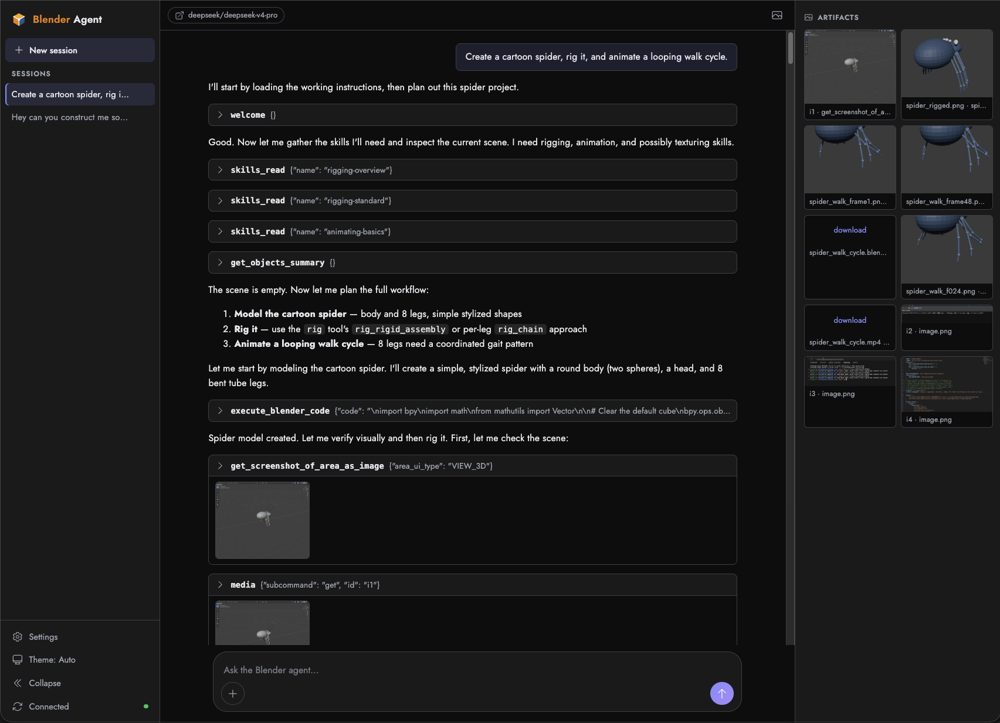
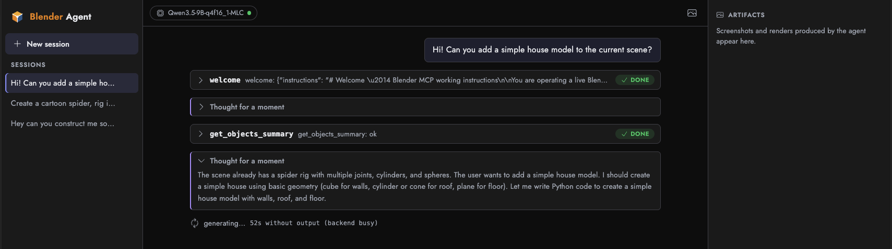
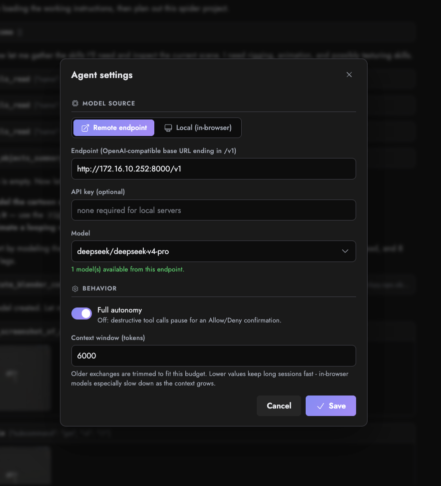
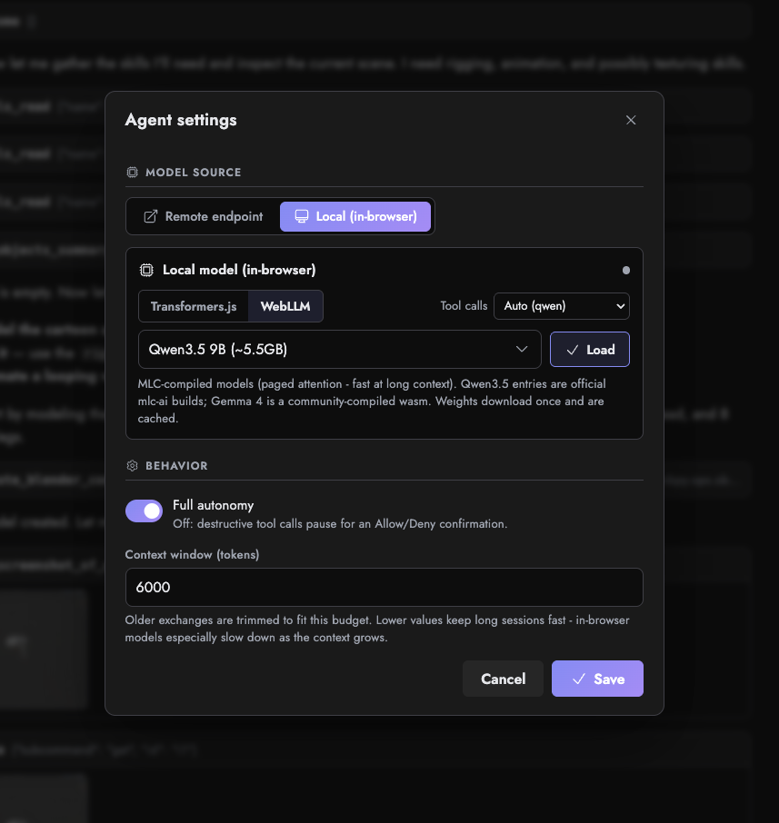
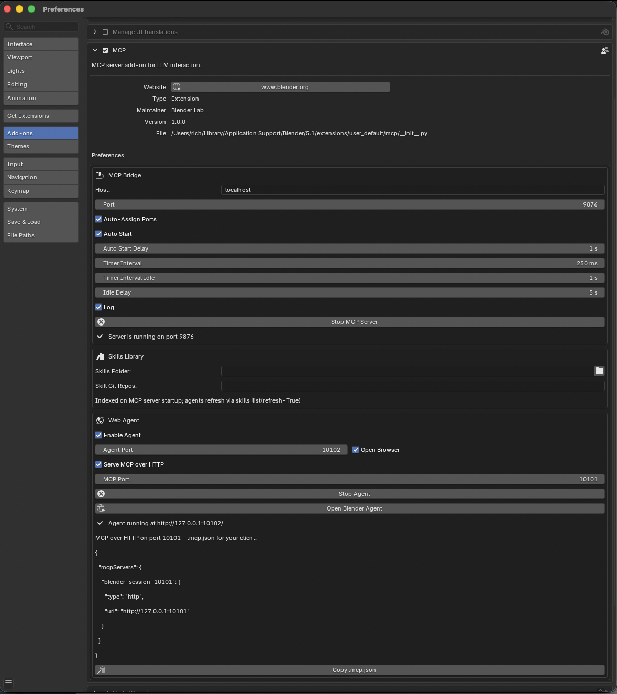
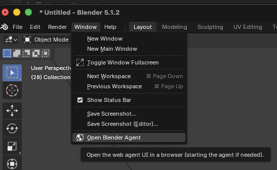

# Blender Agent

**A self-hosted, autonomous agent for Blender — and the toolset behind it.**
Describe what you want in plain language and the agent inspects the scene,
writes and runs `bpy` code, rigs and animates, renders stills and video, and
shows its work — in a browser UI, over an OpenAI-compatible API, or driven by
your own MCP client. Bring any LLM: a remote endpoint, or a model that runs
entirely in your browser on WebGPU.



*One prompt — "create a cartoon spider, rig it, and animate a looping walk
cycle" — driving inspect → skills → code → render, with renders collected in
the artifacts panel.*

> **Built on Blender's official MCP server.** This is a fork of the upstream
> [Blender MCP server](https://www.blender.org/lab/mcp-server/)
> ([projects.blender.org/lab/blender_mcp](https://projects.blender.org/lab/blender_mcp),
> by Blender Lab). The core MCP tool surface and the Blender add-on are
> upstream's work; everything here is layered **on top of** it and the
> original tools remain usable on their own. Credit and thanks to the Blender
> Lab team — see [Credits](#credits).

---

## What this adds

- **Agentic harness + web UI** — a conversational agent (`agent/`,
  `blender-mcp-agent`) that drives Blender through the MCP tools end-to-end:
  multi-turn sessions with transcripts, a confirm gate for destructive
  actions, collapsible tool-call cards and "thinking" blocks, an artifacts
  panel for renders/exports, and automatic context compaction for long jobs.
- **MCP over HTTP** — serve the whole tool surface as a long-lived
  streamable-HTTP endpoint that any number of MCP clients (Claude Code,
  Claude Desktop, …) share, instead of one stdio process per session.
- **OpenAI-compatible chat API** — a `POST /v1/chat/completions` endpoint so
  any OpenAI client can drive Blender headlessly, no browser involved.
- **Bring your own LLM** — any OpenAI-compatible endpoint (OpenAI, vLLM,
  llama.cpp, a lab box) **or** an in-browser model on WebGPU (WebLLM / MLC and
  Transformers.js / ONNX) with no API key and no server-side GPU. *(See the
  [experimental warning](#in-browser-llms-experimental).)*
- **Runs headless / standalone** — launch the agent with no Blender in front
  of it and it spawns its own headless Blender as the compute surface (with a
  process-tree recursion guard so it never fork-bombs itself).
- **Skills library in the core tools** — a searchable playbook of tested
  recipes (`skills_list` / `skills_search` / `skills_read`) plus a `welcome`
  tool that primes any client; sourced from built-ins, a drop folder, git
  repos, and extensions.
- **Tool extensions** (`mcp_ext/`, `blender-mcp-extensions`) — optional
  domain toolsets that self-register: deterministic **rigging/animation**
  (`rig`) for any creature or mechanism, and jailed **media** import/export
  with `ffmpeg` **video** encoding (`media_io`).
- **Deployment** — a `Dockerfile` that bundles a headless Blender, a Helm
  chart at [charts/blender-agent](charts/blender-agent/), multi-arch container
  images, and `make install-dev` to install into Blender's bundled Python on
  Linux/macOS/Windows.

## See it in action

Every tool call is a collapsible card, model reasoning folds into "thinking"
blocks, and renders land in the artifacts panel.



Choose the LLM in Settings. **Remote**: any OpenAI-compatible endpoint.
**Local**: a model that runs entirely in your browser on WebGPU — no key, no
server-side GPU.

| Remote endpoint | In-browser (WebGPU) |
| :---: | :---: |
|  |  |

## Quickstart

1. **Install** the packages into Blender's bundled Python and enable the
   add-on. Pick your platform:

   **Windows** — paste this into PowerShell (no clone, no admin, no
   execution-policy change; it finds Blender via the registry even in an
   unusual install location):

   ```powershell
   irm https://raw.githubusercontent.com/hotspoons/blender-agent/main/scripts/install.ps1 | iex
   ```

   To uninstall, or pin a specific `blender.exe`:

   ```powershell
   & ([scriptblock]::Create((irm https://raw.githubusercontent.com/hotspoons/blender-agent/main/scripts/install.ps1))) -Uninstall
   & ([scriptblock]::Create((irm https://raw.githubusercontent.com/hotspoons/blender-agent/main/scripts/install.ps1))) -BlenderBin "D:\Tools\Blender\blender.exe"
   ```

   (From a checkout, double-click `scripts\install.cmd` instead — same
   thing, no policy change.)

   **Linux / macOS / WSL** — paste into a terminal (no clone needed):

   ```bash
   curl -fsSL https://raw.githubusercontent.com/hotspoons/blender-agent/main/scripts/install.sh | bash
   ```

   To uninstall, or pin a specific binary (note the `bash -s --` for flags):

   ```bash
   curl -fsSL https://raw.githubusercontent.com/hotspoons/blender-agent/main/scripts/install.sh | bash -s -- --uninstall
   curl -fsSL https://raw.githubusercontent.com/hotspoons/blender-agent/main/scripts/install.sh | BLENDER_BIN=/path/to/blender bash
   ```

   (From a checkout: `./scripts/install.sh` or `make install-dev` — same thing,
   no download.)

   All paths are equivalent to `pip install ./mcp ./agent ./mcp_ext` into
   Blender's bundled Python, then building + enabling the add-on extension.

2. **Enable the add-on**: *Edit → Preferences → Add-ons → MCP*. Its panel
   starts the bridge, registers the skills library, and runs the Web Agent.

   

3. **Open the agent**: *Window → Open Blender Agent* (or the button in the
   add-on panel). The UI opens in your browser at `http://127.0.0.1:10102/`.

   

4. **Pick a model** in Settings (remote or in-browser) and start prompting.

Want to drive Blender from your own MCP client instead of the UI? See
[Connecting an MCP client](#connecting-an-mcp-client).

## In-browser LLMs (experimental)

The agent can run the model **entirely in your browser** on WebGPU — no API
key, no server-side GPU, weights cached after first download. Two engines:

- **WebLLM / MLC** — models compiled to WebGPU kernels (paged attention,
  fast decode at long context). Curated list of official `mlc-ai` Qwen3.5
  builds.
- **Transformers.js / ONNX Runtime Web** — the widest catalog (curated
  Qwen3.5, Gemma 4, and GPT-OSS-20B exports), WebGPU with a WASM fallback.

Output is parsed per model family (Qwen XML tool calls, Gemma 4's native
grammar, GPT-OSS harmony channels, or prompt-instructed JSON), and `<think>`
reasoning renders as collapsible cards.

> ### ⚠️ Buyer beware
> **In-browser inference is experimental and can destabilize your system.**
> WebGPU is still maturing across browsers, drivers, and OSes. Loading
> multi-GB models can exhaust GPU/host memory, hang or crash the tab, wedge
> the GPU driver, or in the worst case freeze or reboot the machine — and
> behavior varies wildly by browser and hardware. Save your work first, start
> with the smallest model, prefer a remote endpoint for anything important,
> and treat the in-browser option as a fun, no-cost experiment rather than a
> production backend. You assume the risk.

For serious or unattended work, use a **remote OpenAI-compatible endpoint**.

## Connecting an MCP client

Beyond the agent UI, the same Blender tools can be driven by any MCP client.

**stdio** (default) — the client launches one `blender-mcp` process per
session:

```
MCP Client  ⇐ MCP/stdio ⇒  blender-mcp  ⇐ TCP socket ⇒  Blender Add-on
```

**HTTP** (streamable-HTTP) — one long-lived server shared by many clients:

```
blender-mcp --transport http --port 10101
```

The agent can co-host this too (its Settings → "Serve MCP over HTTP", or the
container's `BLENDER_AGENT_MCP_PORT`). Point a local client at the **MCP
port**:

```json
{
  "mcpServers": {
    "blender": { "type": "http", "url": "http://127.0.0.1:10101" }
  }
}
```

or, with the Claude Code CLI:

```
claude mcp add --transport http blender http://127.0.0.1:10101
```

**Ports & gotchas:**

- Three distinct ports: the TCP **bridge** (`9876`, internal plumbing between
  server and add-on — never an MCP target), the **MCP-over-HTTP** endpoint
  (`10101`, for MCP clients), and the agent **web UI** (`10102`, for you).
  Your `.mcp.json` must point at the **MCP port**, not the UI port.
- **Local only.** The endpoint binds loop-back, so it's reachable from clients
  on the same machine. Cloud/web connectors (e.g. claude.ai custom connectors)
  run on the provider's servers and **cannot** reach your `127.0.0.1` — they
  need a public HTTPS URL (an ngrok/cloudflared tunnel). In a container,
  publish/forward the ports to the host (the dev container forwards
  `9876`/`10101`/`10102`).
- The HTTP endpoint is stateless — connect/disconnect/reconnect freely.
- Anything that can reach the port can run Python in Blender. Only change
  `--host` from the default on a trusted network.

## Headless & API

Run the agent with **no Blender in front of it** and it provisions its own
headless Blender as the compute surface:

```
blender-agent --mcp-port 10101 --spawn-blender   # spawns blender --background
```

Enable the **OpenAI-compatible chat API** so any OpenAI client can drive
Blender without the UI (requires a remote LLM):

```
BLENDER_AGENT_CHAT_API=1 \
BLENDER_AGENT_ENDPOINT=https://your-endpoint/v1 \
BLENDER_AGENT_MODEL=your-model \
blender-agent --port 10102
# then POST to http://127.0.0.1:10102/v1/chat/completions
```

See [agent/readme.md](agent/readme.md) for the full flag/env reference,
standalone-launch internals, and the recursion guard.

## Deployment (Docker + Helm)

The image bundles Blender itself (official binary on amd64, built from source
on arm64), the agent, and the extensions, so a deployed agent brings up its
own headless Blender and needs no external bridge. `ffmpeg` is included for
video encoding.

```
docker run -p 10102:10102 -v blender-agent-data:/data \
  -e BLENDER_AGENT_CHAT_API=1 \
  -e BLENDER_AGENT_ENDPOINT=https://your-endpoint/v1 \
  -e BLENDER_AGENT_MODEL=your-model \
  ghcr.io/hotspoons/blender-agent:latest
```

The [entrypoint](docker/entrypoint.sh) maps env vars onto CLI flags:
`BLENDER_AGENT_HOST` (default `0.0.0.0`), `BLENDER_AGENT_PORT` (`10102`),
`BLENDER_AGENT_MCP_PORT` (opt-in MCP-over-HTTP), `BLENDER_AGENT_DATA_DIR`, and
the chat-API trio above (plus `BLENDER_AGENT_CHAT_API_KEY` to require a bearer
token on the API). Persist `/data` for sessions, skills, and media.

A Helm chart lives at [charts/blender-agent](charts/blender-agent/), and CI
publishes multi-arch images (see [`.github/workflows/docker.yml`](.github/workflows/docker.yml)).

## Architecture

Two long-lived pieces talking over a TCP socket, with the agent and MCP server
sharing one tool surface:

```
                          Browser UI / OpenAI client
                                   ⇕  http
MCP client ⇐ MCP (stdio|http) ⇒  blender-agent / blender-mcp  ⇐ TCP socket ⇒  Blender Add-on
                                   ⇓  https
                          any OpenAI-compatible LLM endpoint
```

- **Blender add-on** (`addon/blender_mcp_addon/`) — runs inside Blender,
  executes requests on the main thread, and exposes the preferences panel
  (bridge, skills library, web agent). Must be installed and enabled.
- **MCP server / agent** (`mcp/`, `agent/`) — separate process(es). The agent
  invokes the `blmcp` tools in-process; external MCP clients reach the same
  tools over stdio or HTTP. Neither touches `bpy` directly — all of that
  marshals through the add-on's bridge.

## Packages

| Path | Package | What it is |
| --- | --- | --- |
| `mcp/` | `blender-mcp` | The MCP server + tool surface + bundled API/manual docs + skills subsystem. |
| `agent/` | `blender-mcp-agent` | The web agent, chat API, in-browser LLM tunnel, standalone launch. |
| `mcp_ext/` | `blender-mcp-extensions` | Optional tool extensions: rigging/animation (`rig`) and media (`media_io`). |
| `addon/` | (Blender extension) | The in-Blender add-on / TCP bridge. |
| `charts/blender-agent/` | — | Helm chart. |

## MCP tools

Core tools (always present):

- `execute_blender_code` / `execute_blender_code_for_cli` — run Python in the
  connected instance, or in a background Blender process.
- `get_blendfile_summary_*` (+ `_for_cli`) — data-blocks, missing files,
  linked libraries, path info, usage guess.
- `get_objects_summary`, `get_object_detail_summary` — scene hierarchy and
  per-object detail.
- `get_mesh_diagnostics` — read-only topology / printability report for a mesh
  (watertight check, open vs non-manifold vs degenerate triage, bounds,
  volume); useful before a boolean, before export, or after applying modifiers.
- `get_python_api_docs` — Blender Python API reference for an identifier (or
  `*` discovery).
- `get_screenshot_of_area_as_image`, `get_screenshot_of_window_as_image`,
  `get_screenshot_of_window_as_json` — visual/structured snapshots.
- `jump_to_tab_by_name`, `jump_to_tab_by_space_type`,
  `jump_to_view3d_object_by_name`, `jump_to_view3d_object_data_by_name` —
  navigate the UI/viewport.
- `render_thumbnail_to_path`, `render_viewport_to_path` — render to a path.
- `welcome`, `skills_list`, `skills_search`, `skills_read` — onboarding and
  the skills library.

With the extensions installed:

- `rig` — deterministic rigging/animation for any creature or mechanism
  (perception, rig standards, validation, Rigify wrappers).
- `media_io` — jailed import/export, frame render, and `ffmpeg` **video**
  encoding (mp4/webm/gif). See [mcp_ext/readme.md](mcp_ext/readme.md).

## Repo layout

```
addon/      Blender add-on (TCP bridge, preferences, agent launcher)
mcp/        blender-mcp: MCP server, tools, bundled docs, skills subsystem
agent/      blender-mcp-agent: harness, web UI, chat API, in-browser LLM tunnel
mcp_ext/    blender-mcp-extensions: rigging + media tool extensions
charts/     Helm chart (blender-agent)
docker/     container entrypoint
docs/       documentation + images
```

## Credits

Blender Agent is a fork of and is built on top of the **Blender MCP server**
by **Blender Lab** — [blender.org/lab/mcp-server](https://www.blender.org/lab/mcp-server/)
· [projects.blender.org/lab/blender_mcp](https://projects.blender.org/lab/blender_mcp).
The core MCP tool surface, the bundled Blender API/manual documentation, and
the Blender add-on originate upstream; this project adds the agent harness,
HTTP/API serving, in-browser LLMs, tool extensions, and deployment. Licensed
GPL-3.0-or-later, matching upstream.

The agentic layer (agent harness, chat-API proxy, browser UI, and skills registry)
was ported from [Foyer Studio](https://github.com/hotspoons/foyer-studio) and reshaped
for Blender.
